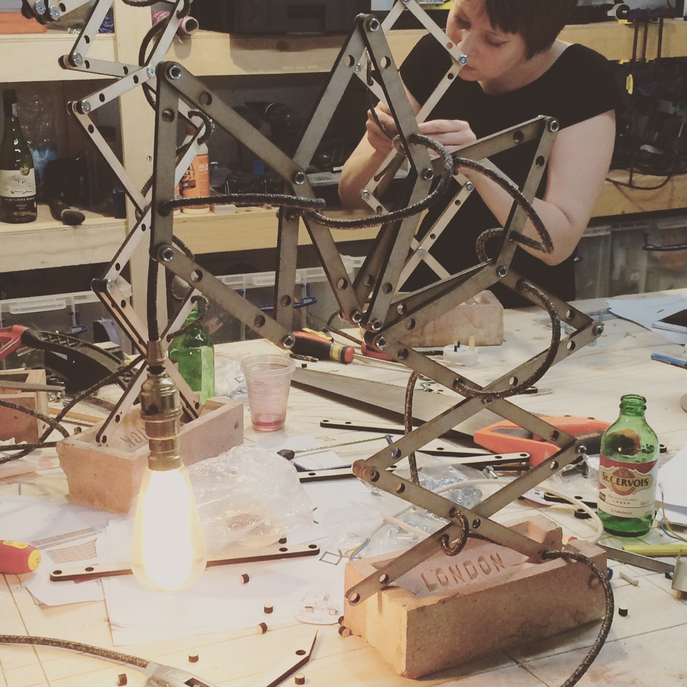

# Brick Lamp v.0.1

Brick lamp is an expandable table lamp design that can be made using simple laser cut pieces and a london stock brick. Please download the above pdf and laser cutting files to begin!

## License 

This design is offered to make for non-commercial use under the terms of the following license: 
[Creative Commons - Attribution-NonCommercial-ShareAlike 4.0 International](https://creativecommons.org/licenses/by-nc-sa/4.0/).

If you would like to use the design for anything not defined by this license please get in touch via this [contact form](http://opendesignschool.co.uk/contact/)

